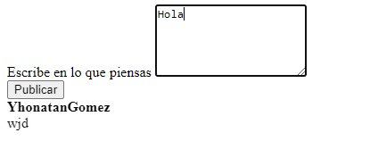
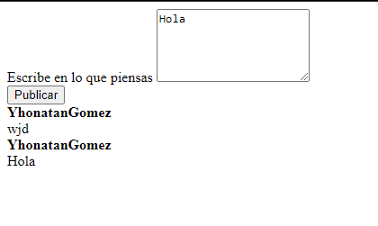
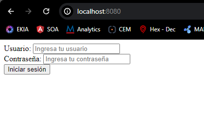
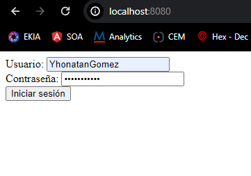

# LABORATORIO 8 - Creación de API con Quarkus para Posts de 140 Caracteres

Este laboratorio consiste en diseñar y desplegar una aplicación monolítica usando Quarkus, que permite a los usuarios publicar mensajes de hasta 140 caracteres. Posteriormente, se transformará la aplicación en microservicios y se desplegará en AWS Lambda, con autenticación a través de JWT y AWS Cognito.

## PRERREQUISITOS

Antes de comenzar, asegúrate de tener instalado y configurado lo siguiente:

- Maven
- Git
- Java
- AWS CLI
- Quarkus

## CONFIGURACIÓN DEL ENTORNO DE DESARROLLO

### Clonar el Repositorio

Clona el repositorio del proyecto desde GitHub y navega al directorio del proyecto.

```
git clone https://github.com/YhonatanGoomez/Microservicios-AREP.git
```

### Construcción del Proyecto

Ejecuta el comando de Maven para limpiar e instalar las dependencias del proyecto.

```
mvn clean install
```

### Ejecución Local

Inicia la aplicación utilizando Quarkus en modo de desarrollo para acceder a ella a través de tu navegador.

```
mvn quarkus:run
http://localhost:8080
```


## FUNCIONALIDAD DE LA APLICACIÓN

La aplicación permite a los usuarios:

- Crear y visualizar hilos de mensajes de hasta 140 caracteres.
- Autenticarse usando credenciales seguras.




### Autenticación

Inicia sesión con los usuarios provistos para acceder a las funcionalidades de la aplicación.




## ARQUITECTURA

### Front-End

- Alojado en un Bucket S3 de AWS.
- Implementado con HTML, CSS y JavaScript.

### Back-End

Dividido en tres microservicios:

1. **Usuario**: Gestión de usuarios y autenticación.
2. **Hilo**: Administración de los hilos de mensajes.
3. **Post**: Control de la creación y visualización de mensajes.

Se tiene una arquitectura basada en microservicios de la siguiente manera


### Seguridad

- Implementación de JWT para autenticación.
- Integración con AWS Cognito para la gestión de usuarios y sesiones.


### Pruebas y Validación

Detalles sobre cómo se realizaron las pruebas para asegurar el funcionamiento de la aplicación en el entorno de AWS.

## AUTOR

- **Yhonatan Steven Gómez Jiménez** 

